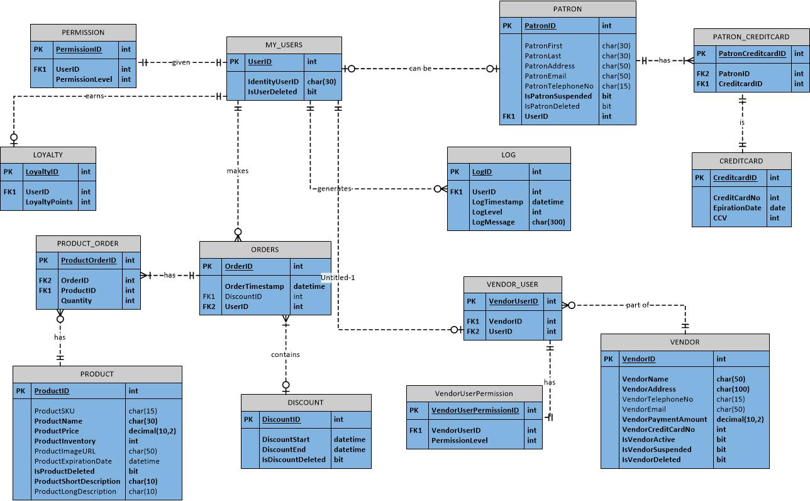

# Final Project
## CS-4790 Spring 2018

### Overview

Build a web-site that allows small kiosk, swap meet and fair sellers can use to inventory and sell products.
The credit card payment gateway will be mocked.  The web application should also have a loyalty feature.  The
loyalty feature should record and email awards based on the amount spent and number of purchases made.  If
there are existing award points for a customer at check-out they should be shown and allowed to apply them
if they wish.  There should be a page for a customer see how many award points they have.  A seller should be
able to create a discount or coupon email that can be sent to all customers who have bought a product within
the last month.

### Schema

### Notes

#### Reward Formula

3 points per $1.00 dollar spent, **not** including tax!

Points | Credit (in-store)
-------|------------------
30 | $10.00
60 | $20.00
90 | $30.00
120| $40.00

#### Coupon Percentages

Number of Purchases | Discount
--------------------|---------
5  | 10%
10 | 20%
20 | 30%
25 | 40%

- Kiosk employees should **not** have privileges to modify customers' information.
- Kiosk employees should be able to enter a *new* customers' information.
- Kiosk employees should **not** be able to add inventory items.

### Grading

Criteria | Ratings | Points
---------|---------|--------
Documentation|20 *full*, 10 *partial*|20
Unit-tests (70> code coverage)|40 *full*, 20 *partial*|40
Controllers (thin)|20 *full*, 10 *partial*|20
Models (business and data)|40 *full*, 20 *partial*|40
Views (functional)|20 *full*, 10 *partial*|20
MySQL|20 *full*,10 *partial*|20
Dependency Injection|10 *full*, 05 *partial*|10
Functional|30 *full*, 15 *partial*|30
**TOTAL**| = |200

### Extra Credit

Criteria | Points
---------|--------
Order Web Service|10
Payment Web Service|10
Customer Web Service|10
Seller Web Service|10
Coupon Emails|15
